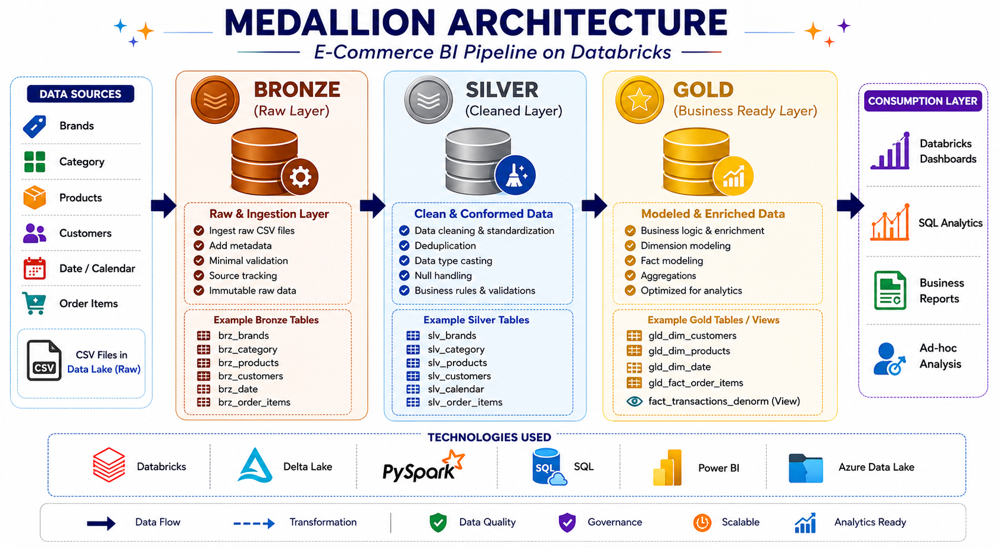
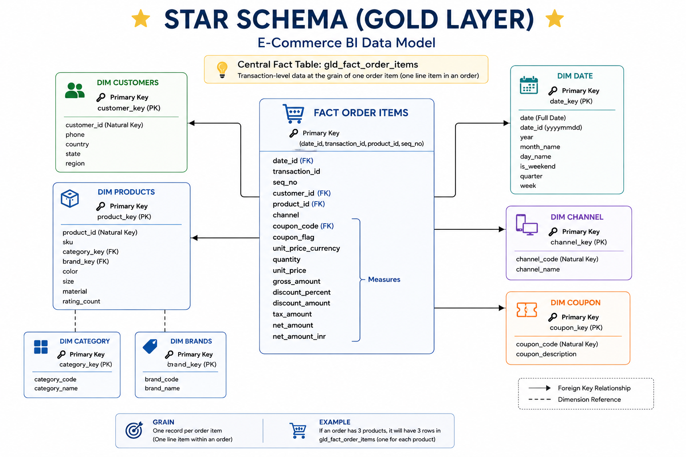
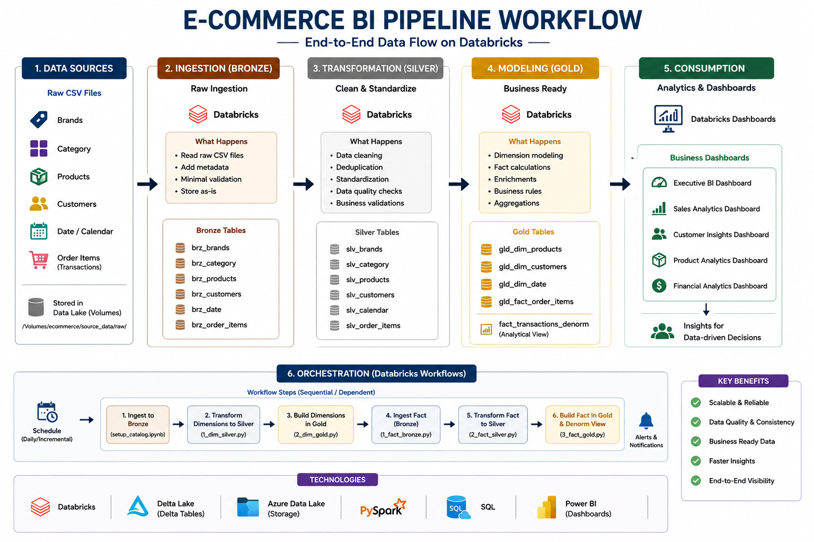

# 🚀 E-Commerce BI Pipeline on Databricks using Medallion Architecture

An end-to-end **Data Engineering + Business Intelligence project** built on **Databricks** using **PySpark**, **Delta Lake**, and a **Medallion Architecture (Bronze → Silver → Gold)** design.

This project simulates a real-world **e-commerce analytics pipeline** by ingesting raw CSV data, transforming it through layered ETL pipelines, modeling it into a **Gold star-schema warehouse**, and powering multiple **business dashboards** for sales, customers, products, and financial analytics.

---

## 📌 Project Overview

The goal of this project is to design and implement a complete **E-Commerce Business Intelligence Pipeline** that demonstrates practical data engineering and analytical reporting workflows.

The pipeline performs the following:

* Ingests raw e-commerce CSV datasets into Databricks
* Stores source data in the **Bronze layer**
* Cleans, standardizes, and transforms data in the **Silver layer**
* Builds **Gold analytical tables** using dimensional modeling
* Creates reporting-ready datasets for **dashboard consumption**
* Supports business reporting across **sales, customer, product, and financial domains**

This project reflects how modern data teams structure scalable analytics pipelines in cloud data platforms.

---

# 🏗️ Architecture

## 1) Medallion Architecture

The project follows a layered **Medallion Architecture** pattern:

* **Bronze** → Raw ingested data from source CSV files
* **Silver** → Cleaned and standardized transformation layer
* **Gold** → Business-ready fact and dimension tables for reporting

<p align="center">
  
</p>

### Layer Summary

#### 🥉 Bronze Layer

* Raw CSV ingestion
* Source-level schema preservation
* Delta table creation for raw entities
* Landing layer for downstream ETL

#### 🥈 Silver Layer

* Data cleaning and standardization
* Null handling and datatype corrections
* Deduplication and transformation logic
* Intermediate trusted analytical staging layer

#### 🥇 Gold Layer

* Dimension and fact table creation
* Star schema modeling
* Reporting-ready analytical views
* Final dashboard consumption layer

---

## 2) Star Schema (Gold Layer)

The Gold layer is modeled as a **star schema** to support BI reporting and analytical queries.

<p align="center">
  
</p>

### Core Gold Tables

#### Fact Table

* `gld_fact_order_items`

#### Dimension Tables

* `gld_dim_products`
* `gld_dim_customers`
* `gld_dim_date`

### Reporting View

* `fact_transactions_denorm`

This structure enables fast and business-friendly analysis across:

* revenue
* orders
* customer behavior
* product performance
* discount and tax metrics

---

## 3) Workflow Pipeline

The ETL workflow is organized as a sequential Databricks notebook pipeline.

<p align="center">
  
</p>

### Execution Flow

```text
Setup Catalog / Environment
        ↓
Dimension Pipeline
   Bronze → Silver → Gold
        ↓
Fact Pipeline
   Bronze → Silver → Gold
        ↓
Gold Reporting Tables / Analytical View
        ↓
Databricks BI Dashboards
```

---

# ⚙️ Tech Stack

| Technology                 | Purpose                                          |
| -------------------------- | ------------------------------------------------ |
| **Databricks**             | Cloud data platform for ETL, SQL, and dashboards |
| **PySpark**                | Distributed data processing and transformations  |
| **Delta Lake**             | Storage layer for Bronze/Silver/Gold tables      |
| **SQL**                    | Transformations, modeling, and reporting logic   |
| **Python**                 | ETL development and notebook scripting           |
| **Databricks Dashboards**  | Business intelligence reporting                  |
| **Medallion Architecture** | Layered data engineering design                  |
| **Star Schema**            | Gold-layer dimensional warehouse modeling        |

---

# 📂 Repository Structure

```text
ecommerce-bi-databricks-pipeline/
│
├── README.md
│
├── architecture/
│   ├── medallion_architecture.png
│   ├── star_schema.png
│   └── workflow_pipeline.png
│
├── notebooks/
│   ├── 1_setup/
│   │   └── setup_catalog.ipynb
│   │
│   ├── 2_dimension_pipeline/
│   │   ├── 1_dim_bronze.py
│   │   ├── 2_dim_silver.py
│   │   └── 3_dim_gold.py
│   │
│   └── 3_fact_pipeline/
│       ├── 1_fact_bronze.py
│       ├── 2_fact_silver.py
│       └── 3_fact_gold.py
│
├── dashboard_screenshots/
│   ├── executive_bi_dashboard.png
│   ├── sales_analytics_dashboard.png
│   ├── customer_insights_dashboard.png
│   ├── product_analytics_dashboard.png
│   └── financial_analytics_dashboard.png
│
├── docs/
│   ├── project_workflow.md
│   ├── medallion_architecture.md
│   ├── star_schema.md
│   ├── data_model.md
│   └── dashboard_summary.md
│
└── sample_data/
    └── sample CSV files / sample source data
```

---

# 📊 Data Pipeline Overview

## Source Data

The project uses multiple e-commerce datasets representing different business entities such as:

* brands
* categories
* products
* customers
* calendar / date
* order items / transactions

These datasets collectively support both **master data modeling** and **transactional analytics**.

---

# 🔄 ETL Pipeline Breakdown

## 1. Setup Layer

The setup notebook initializes the project environment in Databricks.

### Responsibilities

* create / configure catalog, schema, or database objects
* prepare storage locations
* initialize the project environment for ETL execution

---

## 2. Dimension Pipeline

### `1_dim_bronze.py`

Loads or stages raw dimension data into the Bronze layer.

### `2_dim_silver.py`

Cleans and standardizes dimension datasets by applying:

* null handling
* datatype corrections
* data normalization
* data quality transformations

### `3_dim_gold.py`

Builds Gold dimension tables such as:

* product dimension
* customer dimension
* date dimension

---

## 3. Fact Pipeline

### `1_fact_bronze.py`

Loads raw transactional / order item data into Bronze tables.

### `2_fact_silver.py`

Transforms and cleans transaction-level data by applying:

* data quality checks
* schema standardization
* type conversion
* intermediate transformation logic

### `3_fact_gold.py`

Creates Gold fact tables and reporting-ready outputs such as:

* `gld_fact_order_items`
* denormalized analytical reporting view(s)

---

# 🧱 Gold Data Model

The Gold layer is designed for business analytics and dashboard reporting.

## Dimension Tables

* **Product Dimension** → product, brand, category, product attributes
* **Customer Dimension** → customer, country, region, geography
* **Date Dimension** → day, month, quarter, year, reporting periods

## Fact Table

* **Order Item Fact** → transactional measures such as:

  * revenue
  * quantity
  * discount
  * tax
  * order-level metrics

## Reporting View

A denormalized Gold reporting view is used to simplify dashboard development and business analytics consumption.

---

# 📈 Dashboard Suite

The final Gold layer powers multiple Databricks dashboards.

---

## 1) Executive BI Dashboard

A high-level business performance dashboard for summary reporting.

### Focus Areas

* Total Revenue
* Total Orders
* Total Customers
* Average Order Value
* Total Items Sold
* Coupon Usage Rate

<p align="center">
  
</p>

---

## 2) Sales Analytics Dashboard

Analyzes revenue and order trends across time, categories, and brands.

### Focus Areas

* Daily / Monthly Revenue Trend
* Sales by Category
* Top Brands by Revenue
* Revenue by Channel
* Order and quantity metrics

<p align="center">
  
</p>

---

## 3) Customer Insights Dashboard

Provides customer distribution, geography, revenue contribution, and purchase behavior analysis.

### Focus Areas

* Total Customers
* Avg Customer Value
* Revenue by Country / Region
* Customer Purchase Frequency
* Country-wise and region-wise customer metrics

<p align="center">
  
</p>

---

## 4) Product Analytics Dashboard

Focuses on product performance, category contribution, and brand-level analysis.

### Focus Areas

* Total Products
* Total Units Sold
* Avg Unit Price
* Revenue by Category
* Top Brands / Top Products
* Product revenue trends

<p align="center">
  
</p>

---

## 5) Financial Analytics Dashboard

Analyzes revenue composition, discounts, taxes, and channel-level financial performance.

### Focus Areas

* Gross Revenue
* Net Revenue
* Total Discounts
* Total Tax
* Transaction Trends
* Coupon vs Non-Coupon Revenue
* Top Products by Net Revenue

<p align="center">
  
</p>

---

# 📌 Business Questions Answered by the Dashboards

This project enables analysis of questions such as:

### Sales & Revenue

* What are the daily and monthly sales trends?
* Which categories and brands generate the highest revenue?
* How does channel performance vary over time?

### Customer Analytics

* Which countries and regions contribute the most revenue?
* What is the average customer value?
* How frequently do customers place orders?

### Product Analytics

* Which products and brands are top-performing?
* Which categories contribute most to revenue?
* How is product revenue distributed over time?

### Financial Analytics

* What is the relationship between gross revenue, discounts, tax, and net revenue?
* How much revenue comes from coupon vs non-coupon orders?
* Which products contribute the most net revenue?

---

# 🚀 How to Run the Project

## 1. Clone the Repository

```bash
git clone https://github.com/your-username/ecommerce-bi-databricks-pipeline.git
cd ecommerce-bi-databricks-pipeline
```

## 2. Upload Source Data

Upload the raw e-commerce CSV datasets to your Databricks workspace / storage location.

## 3. Run the Setup Notebook

Execute the setup notebook first to initialize the project environment:

```text
notebooks/1_setup/setup_catalog.ipynb
```

## 4. Run the Dimension Pipeline

Execute the dimension notebooks in order:

```text
1_dim_bronze.py
2_dim_silver.py
3_dim_gold.py
```

## 5. Run the Fact Pipeline

Execute the fact notebooks in order:

```text
1_fact_bronze.py
2_fact_silver.py
3_fact_gold.py
```

## 6. Build / Refresh Dashboards

Use the final Gold tables and reporting view to create dashboards in Databricks.

---

# 📚 Documentation

Additional project documentation is available in the `docs/` folder:

* `project_workflow.md` → end-to-end pipeline workflow
* `medallion_architecture.md` → Bronze / Silver / Gold explanation
* `star_schema.md` → Gold warehouse design and relationships
* `data_model.md` → source-to-Gold data model explanation
* `dashboard_summary.md` → summary of dashboard suite and business use cases

---

# 💡 Key Learning Outcomes

This project demonstrates practical implementation of:

* Medallion Architecture in Databricks
* ETL pipelines using PySpark
* Bronze / Silver / Gold layered data engineering
* Dimensional modeling and star schema design
* Delta Lake based analytical table design
* End-to-end business intelligence pipeline development
* Dashboard-oriented data modeling for analytics use cases
* Multi-dashboard reporting for business performance analysis

---

# 🔮 Possible Future Improvements

Some future enhancements that can be added to this project:

* incremental / CDC-based ingestion logic
* data quality validation framework
* parameterized notebook execution
* Databricks workflow/job automation export
* alerting and monitoring layer
* additional advanced KPI dashboards
* dbt / orchestration integration for production-style modeling
* CI/CD workflow for deployment and testing

---

# 👨‍💻 Author

**Dushyant Chaudhary**

If you found this project useful, feel free to star the repository.

---
